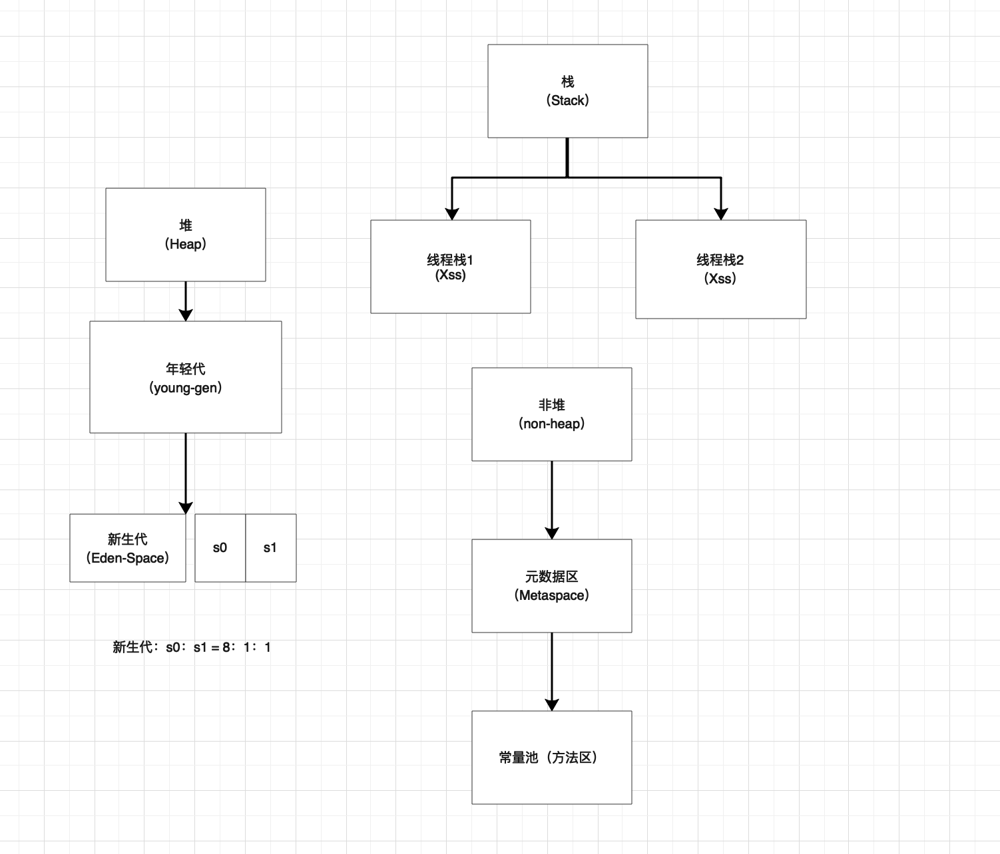

学习笔记

## <a id="Getting_Menu"></a> 目录 
- [开始](#Getting_Menu)
    - [第一题](#first_question)
    - [第二题](#second_question)
    - [第三题](#third_question)


第一课作业实践
===
##### <a id= "first_question"></a> 1、自己写一个简单的 Hello.java，里面需要涉及基本类型，四则运行，if 和 for，然后自己分析一下对应的字节码，有问题群里讨论。

```java

  Last modified 2021-1-15; size 962 bytes
  MD5 checksum e026641ed59b8fe4ffee64e94eda54cf
  Compiled from "HelloWorld.java"
public class study.HelloWorld
  minor version: 0
  major version: 52
  flags: ACC_PUBLIC, ACC_SUPER
Constant pool:
   #1 = Methodref          #14.#25        // java/lang/Object."<init>":()V
   #2 = Fieldref           #26.#27        // java/lang/System.out:Ljava/io/PrintStream;
   #3 = Class              #28            // java/lang/StringBuilder
   #4 = Methodref          #3.#25         // java/lang/StringBuilder."<init>":()V
   #5 = String             #29            // c的值为:
   #6 = Methodref          #3.#30         // java/lang/StringBuilder.append:(Ljava/lang/String;)Ljava/lang/StringBuilder;
   #7 = Methodref          #3.#31         // java/lang/StringBuilder.append:(I)Ljava/lang/StringBuilder;
   #8 = Methodref          #3.#32         // java/lang/StringBuilder.toString:()Ljava/lang/String;
   #9 = Methodref          #33.#34        // java/io/PrintStream.println:(Ljava/lang/String;)V
  #10 = String             #35            // d的值为:
  #11 = String             #36            // e的值为:
  #12 = String             #37            // f的值为:
  #13 = Class              #38            // study/HelloWorld
  #14 = Class              #39            // java/lang/Object
  #15 = Utf8               <init>
  #16 = Utf8               ()V
  #17 = Utf8               Code
  #18 = Utf8               LineNumberTable
  #19 = Utf8               main
  #20 = Utf8               ([Ljava/lang/String;)V
  #21 = Utf8               StackMapTable
  #22 = Class              #40            // "[Ljava/lang/String;"
  #23 = Utf8               SourceFile
  #24 = Utf8               HelloWorld.java
  #25 = NameAndType        #15:#16        // "<init>":()V
  #26 = Class              #41            // java/lang/System
  #27 = NameAndType        #42:#43        // out:Ljava/io/PrintStream;
  #28 = Utf8               java/lang/StringBuilder
  #29 = Utf8               c的值为:
  #30 = NameAndType        #44:#45        // append:(Ljava/lang/String;)Ljava/lang/StringBuilder;
  #31 = NameAndType        #44:#46        // append:(I)Ljava/lang/StringBuilder;
  #32 = NameAndType        #47:#48        // toString:()Ljava/lang/String;
  #33 = Class              #49            // java/io/PrintStream
  #34 = NameAndType        #50:#51        // println:(Ljava/lang/String;)V
  #35 = Utf8               d的值为:
  #36 = Utf8               e的值为:
  #37 = Utf8               f的值为:
  #38 = Utf8               study/HelloWorld
  #39 = Utf8               java/lang/Object
  #40 = Utf8               [Ljava/lang/String;
  #41 = Utf8               java/lang/System
  #42 = Utf8               out
  #43 = Utf8               Ljava/io/PrintStream;
  #44 = Utf8               append
  #45 = Utf8               (Ljava/lang/String;)Ljava/lang/StringBuilder;
  #46 = Utf8               (I)Ljava/lang/StringBuilder;
  #47 = Utf8               toString
  #48 = Utf8               ()Ljava/lang/String;
  #49 = Utf8               java/io/PrintStream
  #50 = Utf8               println
  #51 = Utf8               (Ljava/lang/String;)V
{
  public study.HelloWorld();
    descriptor: ()V
    flags: ACC_PUBLIC
    Code:
      stack=1, locals=1, args_size=1
         0: aload_0
         1: invokespecial #1                  // Method java/lang/Object."<init>":()V
         4: return
      LineNumberTable:
        line 3: 0

  public static void main(java.lang.String[]);
    descriptor: ([Ljava/lang/String;)V
    flags: ACC_PUBLIC, ACC_STATIC
    Code:
      stack=3, locals=8, args_size=1
         0: iconst_2
         1: istore_1
         2: iconst_4
         3: istore_2
         4: iload_1
         5: iload_2
         6: iadd
         7: istore_3
         8: iload_2
         9: iload_1
        10: isub
        11: istore        4
        13: iload_1
        14: iload_2
        15: imul
        16: istore        5
        18: iload_2
        19: iload_1
        20: idiv
        21: istore        6
        23: iconst_0
        24: istore        7
        26: iload         7
        28: iload         5
        30: if_icmpgt     169
        33: iload         7
        35: iload_3
        36: if_icmpne     64
        39: getstatic     #2                  // Field java/lang/System.out:Ljava/io/PrintStream;
        42: new           #3                  // class java/lang/StringBuilder
        45: dup
        46: invokespecial #4                  // Method java/lang/StringBuilder."<init>":()V
        49: ldc           #5                  // String c的值为:
        51: invokevirtual #6                  // Method java/lang/StringBuilder.append:(Ljava/lang/String;)Ljava/lang/StringBuilder;
        54: iload_3
        55: invokevirtual #7                  // Method java/lang/StringBuilder.append:(I)Ljava/lang/StringBuilder;
        58: invokevirtual #8                  // Method java/lang/StringBuilder.toString:()Ljava/lang/String;
        61: invokevirtual #9                  // Method java/io/PrintStream.println:(Ljava/lang/String;)V
        64: iload         7
        66: iload         4
        68: if_icmpne     97
        71: getstatic     #2                  // Field java/lang/System.out:Ljava/io/PrintStream;
        74: new           #3                  // class java/lang/StringBuilder
        77: dup
        78: invokespecial #4                  // Method java/lang/StringBuilder."<init>":()V
        81: ldc           #10                 // String d的值为:
        83: invokevirtual #6                  // Method java/lang/StringBuilder.append:(Ljava/lang/String;)Ljava/lang/StringBuilder;
        86: iload         4
        88: invokevirtual #7                  // Method java/lang/StringBuilder.append:(I)Ljava/lang/StringBuilder;
        91: invokevirtual #8                  // Method java/lang/StringBuilder.toString:()Ljava/lang/String;
        94: invokevirtual #9                  // Method java/io/PrintStream.println:(Ljava/lang/String;)V
        97: iload         7
        99: iload         5
       101: if_icmpne     130
       104: getstatic     #2                  // Field java/lang/System.out:Ljava/io/PrintStream;
       107: new           #3                  // class java/lang/StringBuilder
       110: dup
       111: invokespecial #4                  // Method java/lang/StringBuilder."<init>":()V
       114: ldc           #11                 // String e的值为:
       116: invokevirtual #6                  // Method java/lang/StringBuilder.append:(Ljava/lang/String;)Ljava/lang/StringBuilder;
       119: iload         5
       121: invokevirtual #7                  // Method java/lang/StringBuilder.append:(I)Ljava/lang/StringBuilder;
       124: invokevirtual #8                  // Method java/lang/StringBuilder.toString:()Ljava/lang/String;
       127: invokevirtual #9                  // Method java/io/PrintStream.println:(Ljava/lang/String;)V
       130: iload         7
       132: iload         6
       134: if_icmpne     163
       137: getstatic     #2                  // Field java/lang/System.out:Ljava/io/PrintStream;
       140: new           #3                  // class java/lang/StringBuilder
       143: dup
       144: invokespecial #4                  // Method java/lang/StringBuilder."<init>":()V
       147: ldc           #12                 // String f的值为:
       149: invokevirtual #6                  // Method java/lang/StringBuilder.append:(Ljava/lang/String;)Ljava/lang/StringBuilder;
       152: iload         6
       154: invokevirtual #7                  // Method java/lang/StringBuilder.append:(I)Ljava/lang/StringBuilder;
       157: invokevirtual #8                  // Method java/lang/StringBuilder.toString:()Ljava/lang/String;
       160: invokevirtual #9                  // Method java/io/PrintStream.println:(Ljava/lang/String;)V
       163: iinc          7, 1
       166: goto          26
       169: return
      LineNumberTable:
        line 6: 0
        line 7: 2
        line 8: 4
        line 9: 8
        line 10: 13
        line 11: 18
        line 12: 23
        line 13: 33
        line 14: 39
        line 16: 64
        line 17: 71
        line 19: 97
        line 20: 104
        line 22: 130
        line 23: 137
        line 12: 163
        line 26: 169
      StackMapTable: number_of_entries = 6
        frame_type = 255 /* full_frame */
          offset_delta = 26
          locals = [ class "[Ljava/lang/String;", int, int, int, int, int, int, int ]
          stack = []
        frame_type = 37 /* same */
        frame_type = 32 /* same */
        frame_type = 32 /* same */
        frame_type = 32 /* same */
        frame_type = 250 /* chop */
          offset_delta = 5
}

```
分析：

Last modified 为最后修改时间

size为编译文件大小

MD5 checksum 为验证文件的MD5校验值

Compiled from "HelloWorld.java" 表示编译文件来自于HelloWorld.java

major version: 52 中的 52表示编译使用的JDK版本为JDK8

Constant pool: 表示常量池，里面一共有51个常量，其中Methodref表示方法，Class表示类，String表示String对象。

Code部分，前面的数字表示执行顺序，后面的#3表示调用执行的本地变量池对应的编号。iadd中的i表示是一个int类型，而后面的add表示的是算术运算符的加。new #3表示new一个常量池中3号的对象。invokespecial #4  表示调用常量池中4号的构造函数。

---

##### <a id= "second_question"></a> 2、自定义一个 Classloader，加载一个 Hello.xlass 文件，执行 hello 方法， 此文件内容是一个 Hello.class 文件所有字节(x=255-x)处理后的文件。文件群里提供。

[演示代码](/JAVA-01/test/src/test/JvmClassLoader.java)

---

##### <a id= "third_question"></a> 3、画一张图，展示 Xmx、Xms、Xmn、Metaspache、DirectMemory、Xss 这些内存参数的关系。



- xmx:表示最大堆内存大小
- Xms:表示初始堆内存大小
- Xmn:表示年轻代大小，分为三个内存池,Eden(新生代)，s0+s1(两个存活区)
- Metaspache：表示元数据缓存
- DirectMemory：表示堆外内存
- xss:表示每个线程大小